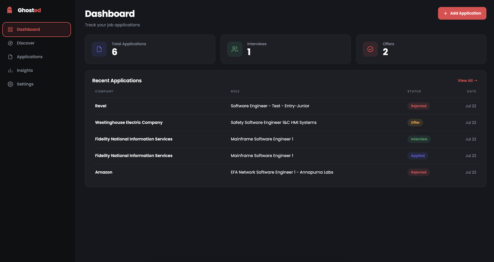
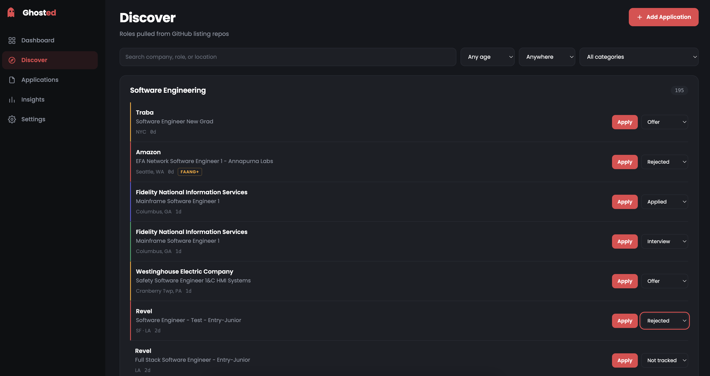
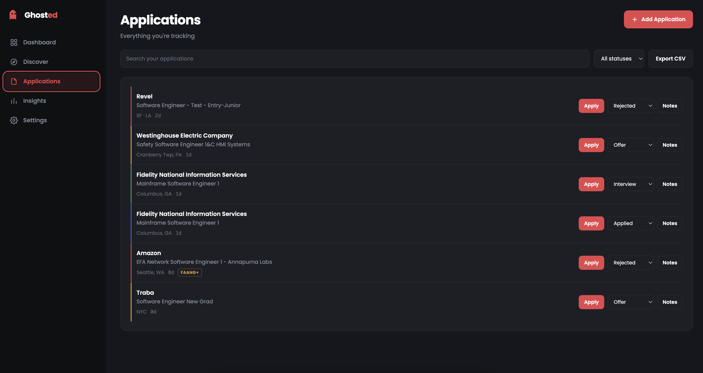
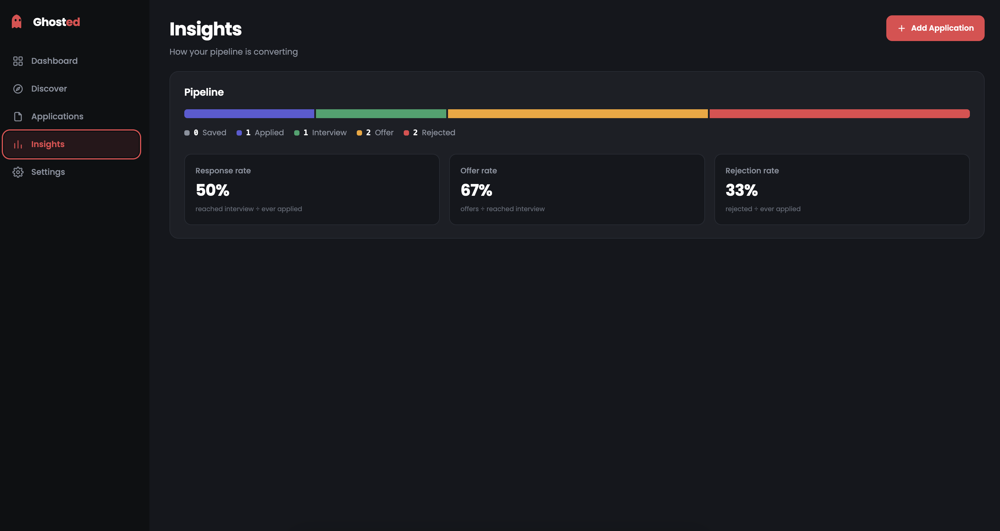

#Ghosted

A job application tracker for new grads and interns. Pull open roles straight from
the GitHub listing repos everyone already uses, then track what you applied to,
where each one stands, and what you learned along the way.

Runs entirely in your browser. No account, no server, no data leaving your machine.



---

## Why

The community job repos — [SimplifyJobs/New-Grad-Positions](https://github.com/SimplifyJobs/New-Grad-Positions),
[Summer Internships](https://github.com/SimplifyJobs/Summer2026-Internships), and their
forks — are the best source of early-career listings. But they're README tables. You
can browse them, and that's it. There's nowhere to record that you applied, nowhere
to note who the recruiter was, and no way to see how your pipeline is actually
converting.

Ghosted reads those repos directly and adds the tracking layer on top.

---

## Features

- **Pull from any GitHub listing repo** — paste a URL, get every open role
- **Category grouping** that mirrors the source README exactly, in the same order
- **Five-stage pipeline** — Saved → Applied → Interview → Offer → Rejected
- **Per-role notes** for recruiter names, interview dates, take-home details
- **Filters** by search, recency, region, and category
- **Conversion metrics** — response rate, offer rate, rejection rate
- **CSV export** for backup or your own analysis
- **Role badges** carried over from the source: FAANG+, advanced degree required,
  no sponsorship, US citizenship required

---

## Screens

### Discover

Roles pulled from your configured repos, grouped by category. Every row links
straight to the real application page, and the dropdown drops it into your pipeline
without leaving the list.



### Applications

Everything you're tracking, newest activity first. Expand any row to write notes.
The colored left edge encodes the stage at a glance.



### Insights

How your pipeline is actually converting.



---

## Setup

**Requires [Node.js](https://nodejs.org) 18 or newer.** Check with `node -v`.

```bash
git clone https://github.com/mbushmn/ghosted.git
cd ghosted/applytrace
npm install
npm run dev
```

Open the printed `localhost` URL. That's it — nothing else to configure.

### Adding your first source

1. Go to **Settings**
2. Paste a repo URL, e.g. `github.com/SimplifyJobs/New-Grad-Positions`
3. Hit **Add source**

Roles appear under **Discover** within a few seconds. Sources persist, so you only
do this once.

Repos known to work:

| Repo | Roles |
|---|---|
| `SimplifyJobs/New-Grad-Positions` | New grad, full-time |
| `SimplifyJobs/Summer2026-Internships` | Internships |
| `vanshb03/Summer2027-Internships` | Internships |

Most forks of these work too, since they share the same README structure.

### Building for production

```bash
npm run build      # static files land in dist/
npm run preview    # serve the build locally
```

`dist/` is plain static output — it deploys to Vercel, Netlify, GitHub Pages, or any
static host with no backend.

---

## How it works

### Reading the repos

Those repos publish two things: a `README.md` and a raw `.github/scripts/listings.json`.
Ghosted reads **the README**, and that choice matters.

The JSON is a complete historical archive — for New-Grad-Positions it's ~11.9 MB and
17,000+ records, of which only a fraction are genuinely live. The `active` flag on
older entries is maintained lazily and isn't reliable. The README, by contrast, is the
curated list the maintainers actually publish: correct roles, correct categories,
correct order.

So the parser reads the README's HTML tables directly, splits each category at its
`🗃️ Inactive roles` block, and keeps only the live rows. It reproduces the published
counts exactly. `listings.json` remains a fallback for repos without a usable README
table.

A few details it handles: `↳` continuation rows inherit the company above them,
`<details>` blocks expand into full location lists, `🔒` marks closed roles, and the
legend emoji become badges.

### Storing your pipeline

**Tracking a role copies it into your own storage rather than referencing the feed.**
Listings churn constantly — roles get closed and disappear from the README within
days. If your pipeline held pointers into a live feed, your application history would
quietly rot. Snapshots mean a job you applied to in March is still there in June, and
the Applications tab works with no network at all.

Everything is saved to your browser's `localStorage` under the key `ghosted:v1`.

---

## Good to know

**Your data is per-browser, per-origin.** `localhost:5173` and `localhost:5174` are
different origins with separate storage. If Vite drifts to a different port, your
pipeline will look empty — it's safe, just on the other port. `vite.config.js` pins
the port with `strictPort` so this fails loudly instead of silently.

Clearing site data, switching browsers, or using a private window will also hide it.
**Use Export CSV for real backups.**

**Public repos only.** The browser fetches GitHub directly with no proxy, so private
repos aren't reachable.

**Repos get renamed each season.** `Summer2026` becomes `Summer2027` and GitHub
serves a 301 — but the raw endpoint still answers on the old name with a frozen
snapshot. If a source looks stale, check whether it's been renamed.

**Rejections are terminal.** A role marked Rejected doesn't record whether it got an
interview first, so response rate treats every rejection as pre-interview. Real
response rate is likely a little higher than shown.

---

## Tech stack

| | |
|---|---|
| Build | Vite |
| UI | React |
| Language | JavaScript + JSX |
| Styling | Vanilla CSS |
| State | React hooks |
| Storage | `localStorage` |
| Runtime dependencies | `react`, `react-dom` |

No backend, no database, no router, no CSS framework, no state library.

```
applytrace/
├── index.html
├── vite.config.js
├── package.json
└── src/
    ├── main.jsx           # entry point
    ├── storage-shim.js    # localStorage adapter
    └── applytrace.jsx     # parser, state, and UI
```

---

## Roadmap

- [ ] Follow-up reminders for applications sitting untouched
- [ ] A dedicated **Ghosted** stage for the ones that just go silent
- [ ] Deadline tracking
- [ ] Optional sync so the pipeline follows you across devices

---

## Acknowledgements

Listing data comes from [SimplifyJobs](https://github.com/SimplifyJobs),
[Pitt CSC](https://github.com/pittcsc), and the contributors who maintain those repos.
Ghosted only reads what they publish.
